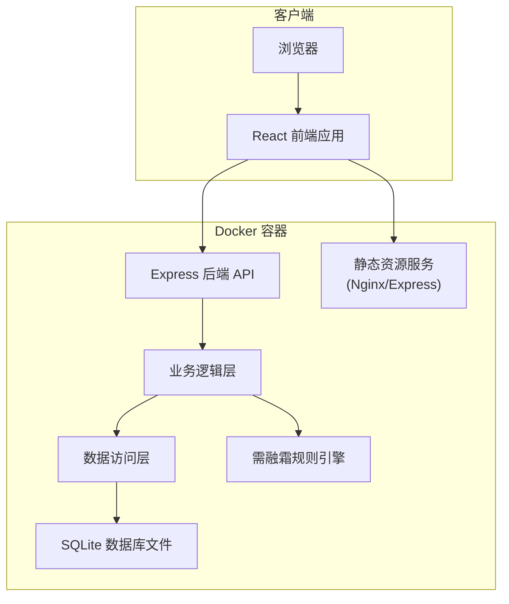
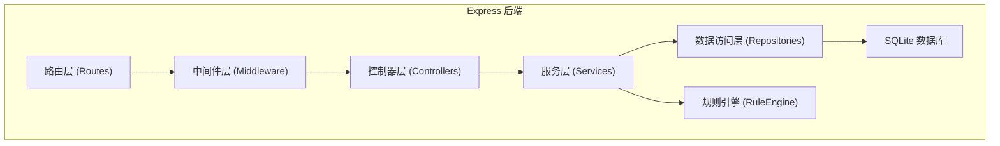
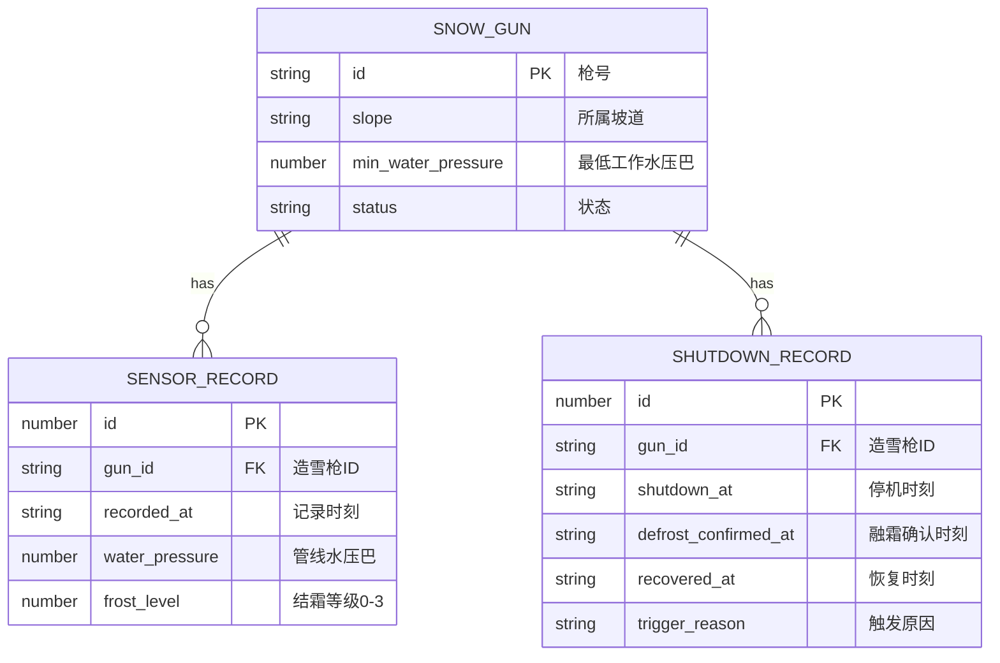

## 1. 架构设计



## 2. 技术描述

- **前端**：React@18 + TypeScript + Vite + TailwindCSS@3 + React Router@6 + Chart.js + react-chartjs-2
- **后端**：Node.js + Express@4 + TypeScript + better-sqlite3
- **数据库**：SQLite（嵌入式，无需单独容器，数据文件挂载持久化）
- **初始化工具**：Vite 初始化前端项目，手动搭建后端结构
- **Docker**：多阶段构建，前端构建产物由后端统一提供静态服务

## 3. 路由定义

### 前端路由

| 路由路径 | 页面名称 | 描述 |
|----------|----------|------|
| / | 坡道看板 | 按坡道分组展示造雪枪状态 |
| /gun/:id | 单枪详情 | 展示单枪水压折线图、结霜等级、停机记录 |
| /todo | 需融霜待办 | 需融霜列表与融霜确认 |
| /recovery | 恢复登记 | 待恢复列表与恢复运行登记 |

### 后端 API 路由

| 方法 | 路径 | 描述 |
|------|------|------|
| GET | /api/guns | 获取所有造雪枪列表 |
| GET | /api/guns/:id | 获取单枪详情 |
| GET | /api/guns/:id/sensor-records | 获取单枪传感记录 |
| GET | /api/guns/:id/shutdown-records | 获取单枪停机记录 |
| POST | /api/sensor-records | 上报传感记录（触发规则校验） |
| GET | /api/todo/defrost | 获取需融霜待办列表 |
| POST | /api/todo/defrost/:id/confirm | 确认融霜完成 |
| GET | /api/todo/recovery | 获取待恢复列表 |
| POST | /api/shutdown/:id/recover | 登记恢复运行 |

## 4. API 定义

### 类型定义

```typescript
// 造雪枪状态枚举
type GunStatus = 'normal' | 'defrost_required' | 'defrost_completed' | 'recovered';

// 造雪枪
interface SnowGun {
  id: string;           // 枪号
  slope: string;        // 所属坡道
  minWaterPressure: number;  // 最低工作水压（巴）
  status: GunStatus;
  currentWaterPressure?: number;
  currentFrostLevel?: number;
}

// 传感记录
interface SensorRecord {
  id: number;
  gunId: string;
  recordedAt: string;   // ISO 时间戳
  waterPressure: number;  // 管线水压（巴）
  frostLevel: 0 | 1 | 2 | 3;  // 结霜等级
}

// 停机登记
interface ShutdownRecord {
  id: number;
  gunId: string;
  shutdownAt: string;    // 停机时刻
  defrostConfirmedAt?: string;  // 融霜完成确认时刻
  recoveredAt?: string;  // 恢复时刻（可空）
  triggerReason?: string; // 触发原因
}

// 规则校验结果
interface RuleCheckResult {
  triggered: boolean;
  lowPressureCount: number;
  latestFrostLevel: number;
  shutdownRecord?: ShutdownRecord;
}
```

### 请求/响应示例

**上报传感记录**
```typescript
// POST /api/sensor-records
// Request Body:
{
  "gunId": "G001",
  "waterPressure": 3.2,
  "frostLevel": 2
}

// Response:
{
  "success": true,
  "recordId": 1024,
  "ruleCheck": {
    "triggered": true,
    "lowPressureCount": 3,
    "latestFrostLevel": 2,
    "shutdownRecord": {
      "id": 128,
      "gunId": "G001",
      "shutdownAt": "2024-01-15T10:30:00.000Z"
    }
  }
}
```

**确认融霜完成**
```typescript
// POST /api/todo/defrost/:id/confirm
// Response:
{
  "success": true,
  "shutdownRecord": {
    "id": 128,
    "gunId": "G001",
    "defrostConfirmedAt": "2024-01-15T10:45:00.000Z"
  }
}
```

## 5. 服务器架构图



## 6. 数据模型

### 6.1 ER 图



### 6.2 DDL 语句

```sql
-- 造雪枪表
CREATE TABLE IF NOT EXISTS snow_guns (
  id TEXT PRIMARY KEY,
  slope TEXT NOT NULL,
  min_water_pressure REAL NOT NULL,
  status TEXT NOT NULL DEFAULT 'normal'
);

-- 传感记录表
CREATE TABLE IF NOT EXISTS sensor_records (
  id INTEGER PRIMARY KEY AUTOINCREMENT,
  gun_id TEXT NOT NULL,
  recorded_at TEXT NOT NULL,
  water_pressure REAL NOT NULL,
  frost_level INTEGER NOT NULL CHECK (frost_level IN (0, 1, 2, 3)),
  FOREIGN KEY (gun_id) REFERENCES snow_guns(id)
);

-- 索引：加速按枪号和时间查询
CREATE INDEX IF NOT EXISTS idx_sensor_gun_time ON sensor_records(gun_id, recorded_at DESC);

-- 停机登记表
CREATE TABLE IF NOT EXISTS shutdown_records (
  id INTEGER PRIMARY KEY AUTOINCREMENT,
  gun_id TEXT NOT NULL,
  shutdown_at TEXT NOT NULL,
  defrost_confirmed_at TEXT,
  recovered_at TEXT,
  trigger_reason TEXT,
  FOREIGN KEY (gun_id) REFERENCES snow_guns(id)
);

-- 索引：按枪号和停机状态查询
CREATE INDEX IF NOT EXISTS idx_shutdown_gun ON shutdown_records(gun_id);
CREATE INDEX IF NOT EXISTS idx_shutdown_status ON shutdown_records(recovered_at);
```

### 6.3 初始演示数据

```sql
-- 造雪枪数据（4条坡道，共12把枪）
INSERT INTO snow_guns (id, slope, min_water_pressure) VALUES
('A001', '初级道A', 4.0), ('A002', '初级道A', 4.0), ('A003', '初级道A', 4.0),
('B001', '中级道B', 4.5), ('B002', '中级道B', 4.5), ('B003', '中级道B', 4.5),
('C001', '高级道C', 5.0), ('C002', '高级道C', 5.0), ('C003', '高级道C', 5.0),
('D001', '魔毯D', 3.5), ('D002', '魔毯D', 3.5), ('D003', '魔毯D', 3.5);
```

## 7. 核心业务规则实现

### 7.1 需融霜规则判断逻辑

```
函数 checkDefrostRule(gunId):
  1. 获取造雪枪当前状态
  2. 如果状态不是 'normal'，返回 { triggered: false }（规则冻结）
  3. 获取造雪枪最低工作水压 minPressure
  4. 查询最近10分钟内的传感记录，按时间倒序
  5. 统计水压 < minPressure 的记录数 lowPressureCount
  6. 获取最新一条记录的结霜等级 latestFrostLevel
  7. 如果 lowPressureCount >= 3 且 latestFrostLevel >= 2:
     a. 更新造雪枪状态为 'defrost_required'
     b. 创建停机登记记录，shutdown_at = 当前时间
     c. 返回 { triggered: true, ... }
  8. 否则返回 { triggered: false, ... }
```

### 7.2 需融霜期间补报数据处理

当造雪枪状态为 `defrost_required` 或 `defrost_completed` 时：
1. 传感数据正常写入 `sensor_records` 表
2. 跳过需融霜规则校验步骤
3. 更新造雪枪的 `currentWaterPressure` 和 `currentFrostLevel` 字段
4. 前端展示最新数据，但不触发新的状态变更
