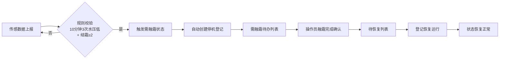

## 1. 产品概述

滑雪场造雪班组「管线水压跌落与枪头结霜停机」联调登记系统，用于实时监控造雪枪运行状态，自动识别需融霜的造雪枪并登记停机与恢复记录，提升造雪作业安全性与效率。

- 核心目标：通过水压与结霜数据的联动分析，自动触发需融霜预警，规范停机与恢复登记流程
- 目标用户：滑雪场造雪班组作业人员、班组长

## 2. 核心功能

### 2.1 用户角色

本系统为内部作业系统，无复杂角色区分，统一为造雪班组操作人员。

| 角色 | 注册方式 | 核心权限 |
|------|----------|----------|
| 造雪班组操作员 | 无登录，直接使用 | 查看坡道看板、查看单枪详情、确认融霜完成、登记恢复运行 |

### 2.2 功能模块

1. **坡道看板**：按坡道分组展示所有造雪枪状态，需融霜枪醒目高亮
2. **单枪详情**：展示单枪水压变化折线图与结霜等级历史
3. **需融霜待办**：列出所有待处理的需融霜造雪枪，支持融霜完成确认
4. **恢复运行登记**：对已完成融霜的造雪枪登记恢复运行时间

### 2.3 页面详情

| 页面名称 | 模块名称 | 功能描述 |
|----------|----------|----------|
| 坡道看板 | 坡道分组展示 | 按坡道分组显示造雪枪卡片，显示枪号、实时水压、结霜等级、状态 |
| 坡道看板 | 状态醒目提示 | 需融霜状态的造雪枪使用红色背景、闪烁动画醒目显示 |
| 单枪详情 | 水压折线图 | 展示最近2小时的水压变化曲线，标注最低工作水压阈值线 |
| 单枪详情 | 结霜等级展示 | 以时间轴形式展示结霜等级变化（0-3级） |
| 单枪详情 | 停机记录 | 展示该枪历史停机与恢复记录 |
| 需融霜待办 | 待办列表 | 列出所有处于需融霜状态的造雪枪，显示枪号、坡道、触发时间、当前结霜等级 |
| 需融霜待办 | 融霜确认 | 一键确认融霜完成，枪状态转为待恢复 |
| 恢复运行登记 | 恢复列表 | 列出所有已完成融霜待恢复的造雪枪 |
| 恢复运行登记 | 恢复确认 | 登记恢复时刻，枪状态转为正常运行 |

## 3. 核心流程

### 3.1 需融霜触发流程

传感数据实时上报 → 系统自动校验规则（10分钟内水压3次低于最低值 + 最近结霜等级≥2）→ 触发需融霜状态 → 自动创建停机登记（停机时刻=触发时间）→ 进入待办列表 → 操作员融霜完成确认 → 进入待恢复列表 → 操作员登记恢复运行 → 状态恢复正常

### 3.2 需融霜期间补报数据处理约定

当造雪枪处于「需融霜」状态期间（从触发需融霜到登记恢复运行前），上报的传感数据处理规则：

1. **数据存储**：所有传感数据仍正常入库保存，不做丢弃
2. **规则冻结**：需融霜状态下，不再对该枪进行新的需融霜规则判断，避免重复触发
3. **结霜等级更新**：最新结霜等级仍会更新显示，便于操作员观察融霜效果
4. **水压趋势**：水压数据仍在折线图中正常展示，可观察管线压力恢复情况
5. **恢复校验**：登记恢复运行时，系统校验最近一条结霜等级是否≤1，若≥2则提示确认

## 4. 用户界面设计

### 4.1 设计风格

- **主色调**：冷蓝色系（#165DFF）作为主色，契合冰雪主题；警示红（#F53F3F）用于需融霜醒目提示
- **辅助色**：冰蓝（#E8F3FF）、霜白（#F2F3F5）、深灰（#1D2129）
- **按钮风格**：圆角8px，实心按钮带微阴影，hover时轻微上浮
- **字体**：Inter 作为无衬线字体，数字使用等宽字体增强可读性
- **布局风格**：卡片式布局，顶部导航 + 左侧菜单 + 主内容区
- **图标风格**：线性图标，冰雪主题元素点缀

### 4.2 页面设计概述

| 页面名称 | 模块名称 | UI 元素 |
|----------|----------|----------|
| 坡道看板 | 坡道分区 | 大字号坡道名称标题，卡片网格布局，需融霜卡片红色脉冲动画 |
| 单枪详情 | 图表区 | 折线图带渐变填充，阈值线虚线红色标注，结霜等级色标（绿-黄-橙-红） |
| 需融霜待办 | 待办卡片 | 倒计时显示触发时长，紧急度视觉分级，一键确认按钮 |
| 恢复登记 | 恢复列表 | 融霜完成时间、当前结霜等级显示，恢复确认模态框 |

### 4.3 响应式

- 桌面端优先设计，支持1280px及以上分辨率
- 平板端自适应，卡片网格自动调整列数
- 移动端单列布局，菜单折叠为汉堡按钮

### 4.4 视觉动效

- 需融霜状态卡片：红色边框脉冲呼吸动画（2秒周期）
- 数据更新：折线图新数据点滑入动画
- 状态切换：渐变过渡动画（0.3秒）
- 按钮hover：轻微上浮 + 阴影加深
